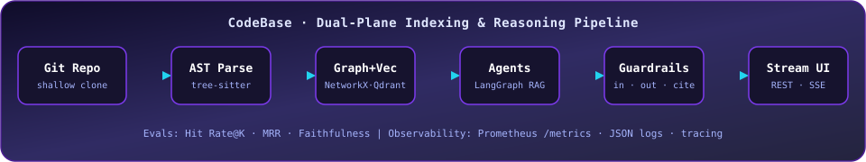
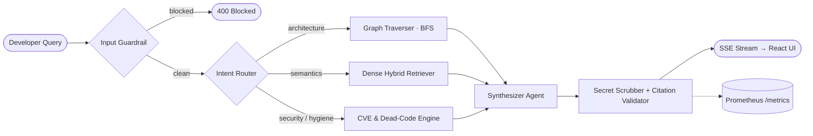

<!-- ═══════════════════════════════════════════════════════════════
     Profile README · Mayank459
     Lives in: github.com/Mayank459/Mayank459  (README.md at repo root)
     Also needs: assets/pipeline.svg  +  .github/workflows/snake.yml
     ═══════════════════════════════════════════════════════════════ -->

<div align="center">


<a href="https://github.com/Mayank459/CodeBase">
  
</a>

<br/>


<a href="https://code-base-tau.vercel.app"></a>
<a href="https://github.com/Mayank459?tab=repositories"></a>

</div>

<br/>

---

## 👨‍💻 &nbsp;About Me

```python
class Mayank:
    handle    = "Mayank459"
    focus     = ["AI-powered developer tools", "RAG & multi-agent systems", "ML applications"]
    flagship  = "CodeBase — repository intelligence engine (FastAPI + LangGraph + Qdrant + React)"
    also_built = ["AutoML dashboard", "AI diet planner", "gesture-based virtual mouse"]
    practices = ["Guardrails first", "Evals over vibes", "Observability by default", "CI on every push"]
    sharpening = ["Data Structures & Algorithms", "System design", "CS fundamentals"]

    def philosophy(self):
        return "If it can't be measured, traced and tested — it isn't production-ready."
```

---

## ⚡ &nbsp;Flagship Project — [CodeBase](https://github.com/Mayank459/CodeBase)

> **An enterprise-style repository intelligence platform.** Point it at a codebase, and it parses it into ASTs, builds a topological call graph, indexes it in a vector DB, and lets you *chat with the architecture* — with safety guardrails, automated evals and Prometheus telemetry built in.

<div align="center">
  
</div>

<br/>

<div align="center">

<a href="https://code-base-tau.vercel.app"></a>
<a href="https://github.com/Mayank459/CodeBase"></a>
<a href="https://github.com/Mayank459/CodeBase/blob/main/BACKEND_ARCHITECTURE.md"></a>

</div>

<table>
  <tr>
    <td width="50%" valign="top">

**🧠 What it does**
- 🌳 Tree-sitter **AST decomposition** into a class/function symbol index
- 🕸️ **NetworkX call-graph** with BFS caller/callee tracing
- 🔎 **Hybrid retrieval** — Cohere 384-d embeddings in **Qdrant**
- 🤖 **LangGraph multi-agent** runtime: router → retriever / traverser / auditor → synthesizer
- 📡 Token-by-token **SSE streaming** to a React workstation UI
- 🔒 CVE-style **security audit**, ✂️ **dead-code detection**, 📐 **UML generation**, 🔄 **multi-repo diff**, 🚀 **human-in-the-loop PR gate**

</td>
    <td width="50%" valign="top">

**🛡️ What makes it production-grade**
- **Input guardrail** — prompt-injection / jailbreak defense
- **Output guardrail** — secret & PII scrubbing (`[REDACTED_API_KEY]`)
- **Citation validator** — flags hallucinated files & symbols
- **Evals harness** — Hit Rate@K, MRR, Faithfulness, Grounding
- **Prometheus** `/metrics` — latency histograms, token counters, violation counters
- **Docker Compose** stack: backend + Qdrant + Prometheus
- **GitHub Actions** CI: `ruff` → `pytest` → evals → Docker build

</td>
  </tr>
</table>

<div align="center">

<sub>📊 Sample output from the repo's own eval suite (`python evals/run_evals.py`)</sub>

| Hit Rate @ 1 | Hit Rate @ 3 | MRR | Citation Grounding | Faithfulness | Answer Relevancy |
|:---:|:---:|:---:|:---:|:---:|:---:|
| **100%** | **100%** | **1.00** | **100%** | **85.2%** | **79.4%** |

</div>

<details>
<summary><b>🗺️ Click to expand — CodeBase agent flow (Mermaid)</b></summary>



</details>

---

## 🧪 &nbsp;More Projects

<table>
  <tr>
    <td width="33%" valign="top">

### 📊 [AutoML Dashboard](https://github.com/Mayank459/streamlit-automl-project)
`Streamlit` `mljar-supervised` `scikit-learn` `Plotly`

No-code, **end-to-end data science** in one app: upload CSV/Excel → EDA & visualizations → Random Forest with GridSearchCV, K-Means with the elbow method, or full **AutoML** (Explain / Perform / Compete / Optuna) → predictions → download trained models.

</td>
    <td width="33%" valign="top">

### 🥗 [DietPlanner](https://github.com/Mayank459/DietPlanner)
`Python` `CatBoost` `PyTorch` `Jupyter`

An **ML-driven diet planning system** — calorie-requirement prediction trained on a 10K-user dataset, a meal recommender, and a **food image classifier** built on the NutritionVerse dataset, developed across 9 experiment notebooks with an API layer on top.

</td>
    <td width="33%" valign="top">

### 🖱️ [Virtual Mouse](https://github.com/Mayank459/Virtual_Mouse)
`Python` `Computer Vision`

A **gesture-controlled mouse** experiment — controlling the cursor with hand movements instead of hardware. *(Early stage — just getting started.)*

</td>
  </tr>
</table>

<div align="center">

<a href="https://github.com/Mayank459/CodeBase"></a>
<a href="https://github.com/Mayank459/streamlit-automl-project"></a>

<a href="https://github.com/Mayank459/DietPlanner"></a>
<a href="https://github.com/Mayank459/Virtual_Mouse"></a>

</div>

---

## 🛠️ &nbsp;Tech Arsenal

<div align="center">

**Core stack**


**ML & Data**


**DevOps & Observability**


</div>

---

## 📊 &nbsp;GitHub Analytics

<div align="center">


</div>

---

## 🐍 &nbsp;Contribution Snake

<div align="center">
  <picture>
    <source media="(prefers-color-scheme: dark)"  srcset="https://raw.githubusercontent.com/Mayank459/Mayank459/output/github-snake-dark.svg" />
    <source media="(prefers-color-scheme: light)" srcset="https://raw.githubusercontent.com/Mayank459/Mayank459/output/github-snake.svg" />
    
  </picture>
</div>

---

## 🧠 &nbsp;Engineering Principles

<table align="center">
  <tr>
    <td align="center" width="25%">🛡️<br/><b>Guardrails First</b><br/><sub>Sanitize inputs, scrub outputs,<br/>validate every citation.</sub></td>
    <td align="center" width="25%">📏<br/><b>Measure Everything</b><br/><sub>Hit Rate, MRR, faithfulness —<br/>evals run in CI.</sub></td>
    <td align="center" width="25%">🔭<br/><b>Observable by Default</b><br/><sub>Structured logs, trace spans,<br/>Prometheus metrics.</sub></td>
    <td align="center" width="25%">🚢<br/><b>Ship It Containerized</b><br/><sub>Docker Compose, health checks,<br/>GitHub Actions pipelines.</sub></td>
  </tr>
</table>

---

## 🎯 &nbsp;Currently

- 🔭 Evolving **CodeBase** — deeper agents, better retrieval, more evals
- 📚 Sharpening **DSA & CS fundamentals** ([LeetCode resources](https://github.com/Mayank459/awesome-leetcode-resources) · [GATE/CSE notes](https://github.com/Mayank459/GATE-and-CSE-Resources-for-Students))
- 🧩 Turning experiments (DietPlanner, Virtual Mouse) into polished, documented projects
- 🤝 Open to feedback, ideas and collaboration on AI-for-developer-tools

---

## 🤝 &nbsp;Let's Connect

<div align="center">

<a href="https://github.com/Mayank459"></a>
<a href="https://code-base-tau.vercel.app"></a>
<!-- Uncomment & fill in whichever you want to show:
<a href="https://www.linkedin.com/in/YOUR_LINKEDIN/"></a>
<a href="mailto:YOUR_EMAIL@example.com"></a>
<a href="https://twitter.com/YOUR_HANDLE"></a>
-->

</div>

---

<div align="center">


<br/><br/>

<sub>⭐ Built for engineers who like to look under the hood — a star on <a href="https://github.com/Mayank459/CodeBase">CodeBase</a> keeps the coffee flowing ☕</sub>


</div>
