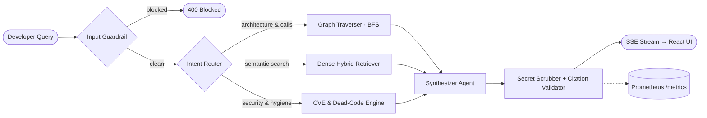

<!-- ═══════════════════════════════════════════════════════════════
     Profile README · Mayank459
     Repository: github.com/Mayank459/Mayank459  (README.md at repo root)
     Assets: assets/pipeline.svg  +  assets/avatar.jpeg  +  .github/workflows/snake.yml
     ═══════════════════════════════════════════════════════════════ -->

<div align="center">


<a href="https://github.com/Mayank459/CodeBase">
  
</a>

<br/>


<a href="https://code-base-tau.vercel.app"></a>
<a href="http://13.60.250.242:3000/d/ecommerce-streaming-v1/e-commerce-real-time-streaming-dashboard?orgId=1&refresh=5s"></a>
<a href="https://github.com/Mayank459?tab=repositories"></a>

</div>

<br/>

---

## 👨‍💻 &nbsp;About Me

```python
class Mayank:
    handle      = "Mayank459"
    role        = "AI Systems & Backend Engineer"
    location    = "India 🇮🇳"
    flagship    = "CodeBase — Enterprise Repository Intelligence Engine"
    
    focus_areas = [
        "Repository intelligence & AST code-graph RAG",
        "High-throughput event streaming (Apache Kafka + Grafana)",
        "Low-latency conversational voice AI (WebSockets + Faster-Whisper + Groq)",
        "Applied ML & Precision Agricultural AI (FastAPI + XGBoost)"
    ]

    core_stack  = ["Python", "FastAPI", "Apache Kafka", "LangGraph", "Qdrant", "React"]
    creed       = ["Guardrails first", "Evals over vibes", "Telemetry by default"]

    def philosophy(self):
        return "If it can't be measured, traced, and tested — it isn't production-ready."
```

<table width="100%">
  <tr>
    <td width="33%" align="center" valign="top">
      <h4>🧠 &nbsp;AI & Developer Tools</h4>
      <sub>Multi-agent AST analyzers, bidirectional call-graph traversers, vector search, and automated CI evaluation harnesses.</sub>
    </td>
    <td width="33%" align="center" valign="top">
      <h4>⚡ &nbsp;Distributed & Real-Time</h4>
      <sub>High-throughput Kafka streaming pipelines, live Grafana telemetry, and sub-second WebSocket voice screening agents.</sub>
    </td>
    <td width="33%" align="center" valign="top">
      <h4>🛡️ &nbsp;Production Reliability</h4>
      <sub>Input prompt defense guardrails, automated secret scrubbing, Prometheus latency histograms, and Docker stacks.</sub>
    </td>
  </tr>
</table>

<div align="center">

> ☕ **Chai &nbsp;»&nbsp; Code &nbsp;»&nbsp; Progress &nbsp;»&nbsp; Repeat** &nbsp;•&nbsp; *Building engines that make complex systems transparent, measurable, and reliable.*

</div>


---

## ⚡ &nbsp;Flagship Project — [CodeBase](https://github.com/Mayank459/CodeBase)

> **Enterprise-style Repository Intelligence Platform.** Point CodeBase at any repository, and it decomposes the codebase into ASTs, constructs a topological call graph, performs hybrid vector retrieval in Qdrant, and orchestrates LangGraph agents so you can *chat with the architecture* — complete with input guardrails, secret scrubbing, automated evals, and Prometheus telemetry.

<div align="center">
  
</div>

<br/>

<div align="center">

<a href="https://code-base-tau.vercel.app"></a>
<a href="https://codebase-2.vercel.app"></a>
<a href="https://github.com/Mayank459/CodeBase"></a>
<a href="https://github.com/Mayank459/CodeBase/blob/main/BACKEND_ARCHITECTURE.md"></a>

</div>

<table>
  <tr>
    <td width="50%" valign="top">

**🧠 Core Intelligence Capabilities**
- 🌳 **Tree-sitter AST decomposition** into semantic classes, functions, and symbols
- 🕸️ **NetworkX Call-Graph** with bidirectional BFS caller/callee tracing
- 🔎 **Hybrid Retrieval** — Cohere 384-d dense embeddings indexed in **Qdrant**
- 🤖 **LangGraph Multi-Agent Runtime**: Intent router → graph traverser / vector retriever / auditor → synthesizer
- 📡 **SSE Streaming** delivering real-time responses to a React workstation UI
- 🔒 **Static Hygiene Suite**: CVE detection, dead-code pruning, auto UML generation, and HITL PR review gate

</td>
    <td width="50%" valign="top">

**🛡️ Production Engineering & Reliability**
- 🛡️ **Input Guardrail** — prompt injection, jailbreak defense & payload scrubbing
- 🧼 **Output Guardrail** — automated secret & PII redaction (`[REDACTED_KEY]`)
- 📌 **Citation Validator** — verifies file paths and symbol names to prevent hallucinations
- 📊 **Evaluation Harness** — CI-integrated Hit Rate@K, MRR, Faithfulness, and Grounding
- 📈 **Prometheus Observability** — token counters, latency histograms, error counters
- 🐳 **Docker Compose Stack** — multi-container backend + Qdrant + Prometheus
- ⚙️ **CI/CD Automation** — `ruff` linting → `pytest` unit tests → evals harness

</td>
  </tr>
</table>

<div align="center">

<sub>📊 Benchmark metrics from CodeBase's automated eval suite (`python evals/run_evals.py`)</sub>

| Hit Rate @ 1 | Hit Rate @ 3 | MRR | Citation Grounding | Faithfulness | Answer Relevancy |
|:---:|:---:|:---:|:---:|:---:|:---:|
| **100%** | **100%** | **1.00** | **100%** | **85.2%** | **79.4%** |

</div>

<details>
<summary><b>🗺️ Click to expand — CodeBase Agent Workflow (Mermaid)</b></summary>
<br/>



</details>

---

## 🚀 &nbsp;Featured Engineering Projects

<table>
  <tr>
    <td width="50%" valign="top">

### 📡 [Real-Time E-Commerce Streaming Platform](https://github.com/Mayank459/Real-time-streaming-dashboard)
`Apache Kafka 7.5.0` `Grafana` `Python` `Stream Processing` `Docker`

End-to-end distributed data streaming platform designed for high-throughput e-commerce transaction monitoring:
- **Event Producer & Pipeline**: Simulates high-concurrency order streams into partition-balanced Kafka topics.
- **Stream Processing**: Aggregates throughput, order volume, revenue metrics, and anomaly flags in real-time.
- **Production Observability**: Live interactive dashboard hosted on AWS EC2 with auto-refreshing telemetry panels.

<a href="http://13.60.250.242:3000/d/ecommerce-streaming-v1/e-commerce-real-time-streaming-dashboard?orgId=1&refresh=5s"></a>
<a href="https://github.com/Mayank459/Real-time-streaming-dashboard"></a>

</td>
    <td width="50%" valign="top">

### 🎙️ [AI Mock Interviewer Voice Agent](https://github.com/Mayank459/ai-voice-agent)
`FastAPI` `WebSockets` `Faster-Whisper` `Groq (Llama 3)` `TTS`

Ultra low-latency conversational AI agent ("Alex") that conducts live technical phone screens:
- **Bi-directional Streaming**: Full-duplex audio transmission using WebSockets for natural conversational pacing.
- **Fast Audio Processing**: Client-side speech transcribed with local `Faster-Whisper` STT.
- **Sub-Second LLM Reasoning**: Accelerated inference via Groq Cloud running Llama 3 for immediate contextual follow-ups.

<a href="https://github.com/Mayank459/ai-voice-agent"></a>
<a href="https://github.com/Mayank459/ai-voice-agent"></a>

</td>
  </tr>

  <tr>
    <td width="50%" valign="top">

### 🌾 [KhetBuddy — Precision AgriTech ML Suite](https://github.com/Mayank459/yeild_prediction_api)
`FastAPI` `Streamlit` `XGBoost` `Random Forest` `Geo Enrichment`

Comprehensive data-driven agricultural intelligence platform for Indian farming ecosystems:
- **Yield Prediction API**: Farmers supply GPS coordinates and crop type — API auto-enriches soil, climate, and elevation data to forecast yield.
- **Fertilizer Recommendation API**: Dual XGBoost & Random Forest models trained on agricultural nutrient indices.
- **Irrigation Advisory**: Environmental sensor telemetry for optimizing field watering schedules.

<a href="https://github.com/Mayank459/yeild_prediction_api"></a>
<a href="https://github.com/Mayank459/fertilizer-recommendation-api"></a>
<a href="https://github.com/Mayank459/yeilld-prediction-streamlit"></a>

</td>
    <td width="50%" valign="top">

### 📊 [No-Code AutoML Dashboard](https://github.com/Mayank459/streamlit-automl-project)
`Streamlit` `mljar-supervised` `Scikit-Learn` `Optuna` `Plotly`

Interactive web application delivering an end-to-end automated machine learning pipeline:
- **Automated EDA**: Dynamic distribution plots, correlation matrices, and missing value imputation.
- **Multi-Model Search**: Benchmarks Random Forests, Gradient Boosters, and baseline classifiers via Optuna.
- **Interactive Predictions & Artifacts**: Generates ROC/PR curves and allows one-click export of serialized models.

<a href="https://github.com/Mayank459/streamlit-automl-project"></a>
<a href="https://github.com/Mayank459/streamlit-automl-project"></a>

</td>
  </tr>

  <tr>
    <td width="50%" valign="top">

### 🧩 [Udemy Lecture AI Summarizer Extension](https://github.com/Mayank459/Udemy-extension)
`JavaScript` `Chrome Extension Manifest V3` `LaTeX / KaTeX` `LLM APIs`

Browser productivity extension providing automated synthesis of online course lectures:
- **Contextual Extraction**: Ingests transcript audio streams and segments lectures into conceptual milestones.
- **Mathematical Rendering**: Parses mathematical proofs and outputs beautifully rendered LaTeX equations.
- **Code Highlighting**: Detects language syntax and formats runnable code snippets from lecture discussions.

<a href="https://github.com/Mayank459/Udemy-extension"></a>
<a href="https://github.com/Mayank459/Udemy-extension"></a>

</td>
    <td width="50%" valign="top">

### 🥗 [DietPlanner & Food Vision Intelligence](https://github.com/Mayank459/DietPlanner)
`Python` `CatBoost` `PyTorch` `FastAPI` `NutritionVerse`

Health and nutrition intelligence platform blending tabular regression with computer vision:
- **Caloric Requirement Engine**: Trained on 10,000 user profiles with CatBoost for tailored basal recommendations.
- **Food Vision Classifier**: PyTorch convolutional network classifying meal photographs using the NutritionVerse dataset.
- **Meal Optimization**: Constraint-based heuristic solver generating balanced macronutrient meal plans.

<a href="https://github.com/Mayank459/DietPlanner"></a>
<a href="https://github.com/Mayank459/food_api"></a>

</td>
  </tr>
</table>

---

## 📂 &nbsp;Repositories At A Glance

<table width="100%">
  <thead>
    <tr>
      <th align="left">Repository</th>
      <th align="left">Focus Area</th>
      <th align="left">Tech Stack</th>
      <th align="center">Live Demo</th>
      <th align="center">Source</th>
    </tr>
  </thead>
  <tbody>
    <tr>
      <td><b><a href="https://github.com/Mayank459/CodeBase">CodeBase</a></b></td>
      <td>Repository Intelligence & AST Q&A</td>
      <td><code>FastAPI</code> <code>LangGraph</code> <code>Qdrant</code> <code>React</code></td>
      <td align="center"><a href="https://code-base-tau.vercel.app"></a></td>
      <td align="center"><a href="https://github.com/Mayank459/CodeBase"></a></td>
    </tr>
    <tr>
      <td><b><a href="https://github.com/Mayank459/Real-time-streaming-dashboard">Real-Time Streaming</a></b></td>
      <td>Kafka E-Commerce Event Analytics</td>
      <td><code>Apache Kafka</code> <code>Grafana</code> <code>Python</code> <code>Docker</code></td>
      <td align="center"><a href="http://13.60.250.242:3000/d/ecommerce-streaming-v1/e-commerce-real-time-streaming-dashboard?orgId=1&refresh=5s"></a></td>
      <td align="center"><a href="https://github.com/Mayank459/Real-time-streaming-dashboard"></a></td>
    </tr>
    <tr>
      <td><b><a href="https://github.com/Mayank459/ai-voice-agent">AI Voice Agent</a></b></td>
      <td>Low-Latency Technical Interviewer</td>
      <td><code>FastAPI</code> <code>WebSockets</code> <code>Whisper</code> <code>Groq</code></td>
      <td align="center"><span style="color:#a78bfa;">Audio Stream</span></td>
      <td align="center"><a href="https://github.com/Mayank459/ai-voice-agent"></a></td>
    </tr>
    <tr>
      <td><b><a href="https://github.com/Mayank459/yeild_prediction_api">KhetBuddy Yield API</a></b></td>
      <td>Precision Agriculture ML Prediction</td>
      <td><code>Python</code> <code>FastAPI</code> <code>Geo-Enrichment</code></td>
      <td align="center"><a href="https://github.com/Mayank459/yeilld-prediction-streamlit"></a></td>
      <td align="center"><a href="https://github.com/Mayank459/yeild_prediction_api"></a></td>
    </tr>
    <tr>
      <td><b><a href="https://github.com/Mayank459/streamlit-automl-project">AutoML Dashboard</a></b></td>
      <td>No-Code End-to-End Data Science</td>
      <td><code>Streamlit</code> <code>mljar</code> <code>Optuna</code> <code>Plotly</code></td>
      <td align="center"><span style="color:#22c55e;">Local/Cloud</span></td>
      <td align="center"><a href="https://github.com/Mayank459/streamlit-automl-project"></a></td>
    </tr>
    <tr>
      <td><b><a href="https://github.com/Mayank459/Udemy-extension">Udemy AI Summary</a></b></td>
      <td>Lecture Synthesis & Math Extraction</td>
      <td><code>JavaScript</code> <code>Chrome Manifest V3</code> <code>LaTeX</code></td>
      <td align="center"><span style="color:#0ea5e9;">Extension</span></td>
      <td align="center"><a href="https://github.com/Mayank459/Udemy-extension"></a></td>
    </tr>
    <tr>
      <td><b><a href="https://github.com/Mayank459/DietPlanner">DietPlanner</a></b></td>
      <td>Calorie & Nutrition Vision Engine</td>
      <td><code>Python</code> <code>CatBoost</code> <code>PyTorch</code> <code>FastAPI</code></td>
      <td align="center"><span style="color:#a78bfa;">Model API</span></td>
      <td align="center"><a href="https://github.com/Mayank459/DietPlanner"></a></td>
    </tr>
    <tr>
      <td><b><a href="https://github.com/Mayank459/Virtual_Mouse">Virtual Mouse</a></b></td>
      <td>Contactless Gesture Cursor Control</td>
      <td><code>Python</code> <code>OpenCV</code> <code>MediaPipe</code></td>
      <td align="center"><span style="color:#fbbf24;">CV App</span></td>
      <td align="center"><a href="https://github.com/Mayank459/Virtual_Mouse"></a></td>
    </tr>
  </tbody>
</table>

---

## 🛠️ &nbsp;Tech Arsenal

<div align="center">

<table align="center">
  <tr>
    <td align="center">
      <b>Languages & Full Stack</b><br/><br/>
      
    </td>
  </tr>
  <tr>
    <td align="center">
      <b>Machine Learning, Data & Distributed Streaming</b><br/><br/>
      
    </td>
  </tr>
  <tr>
    <td align="center">
      <b>AI Agents, Graph Engines & LLM Orchestration</b><br/><br/>
      
      
      
      
      
      
      
      
    </td>
  </tr>
  <tr>
    <td align="center">
      <b>DevOps, Observability & Cloud Platforms</b><br/><br/>
      
    </td>
  </tr>
</table>

</div>

---

## 📊 &nbsp;GitHub Analytics

<div align="center">


<br/><br/>


</div>

---

## 🐍 &nbsp;Contribution Snake

<div align="center">
  <picture>
    <source media="(prefers-color-scheme: dark)"  srcset="https://raw.githubusercontent.com/Mayank459/Mayank459/output/github-snake-dark.svg" />
    <source media="(prefers-color-scheme: light)" srcset="https://raw.githubusercontent.com/Mayank459/Mayank459/output/github-snake.svg" />
    
  </picture>
</div>

---

## 🧠 &nbsp;Engineering Principles

<table align="center">
  <tr>
    <td align="center" width="20%">🛡️<br/><b>Guardrails First</b><br/><sub>Sanitize prompt inputs, redact secrets, validate citations.</sub></td>
    <td align="center" width="20%">📏<br/><b>Evals Over Vibes</b><br/><sub>Hit Rate, MRR, Faithfulness — automated in CI.</sub></td>
    <td align="center" width="20%">⚡<br/><b>Real-Time by Design</b><br/><sub>WebSockets, Kafka streams, SSE token streaming.</sub></td>
    <td align="center" width="20%">🔭<br/><b>Observable by Default</b><br/><sub>Structured logs, trace spans, Prometheus & Grafana metrics.</sub></td>
    <td align="center" width="20%">🚢<br/><b>Containerized Ship</b><br/><sub>Docker Compose, health checks, GitHub Actions pipelines.</sub></td>
  </tr>
</table>

---

## 🎯 &nbsp;Currently Exploring & Building

- 🔭 Expanding **CodeBase 2.0** — deeper AST indexers, multi-repo cross-referencing, and continuous evaluation suites.
- ⚡ Deep-diving into **real-time event architectures** and stream analytics with Apache Kafka.
- 📚 Refining **DSA & System Design** foundations ([LeetCode Resources](https://github.com/Mayank459/awesome-leetcode-resources) · [GATE/CSE Resources](https://github.com/Mayank459/GATE-and-CSE-Resources-for-Students)).
- 🤝 Open to collaboration on open-source AI tooling, agentic systems, and developer infrastructure.

---

## 🤝 &nbsp;Let's Connect

<div align="center">

<a href="https://github.com/Mayank459"></a>
<a href="https://code-base-tau.vercel.app"></a>
<a href="http://13.60.250.242:3000/d/ecommerce-streaming-v1/e-commerce-real-time-streaming-dashboard?orgId=1&refresh=5s"></a>

<br/><br/>


<br/><br/>

<sub>⭐ Built for engineers who look under the hood — a star on <a href="https://github.com/Mayank459/CodeBase">CodeBase</a> or <a href="https://github.com/Mayank459/Real-time-streaming-dashboard">Streaming Dashboard</a> keeps the chai flowing ☕</sub>


</div>
