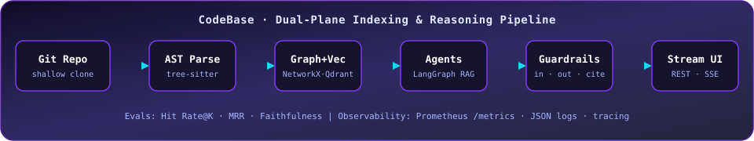
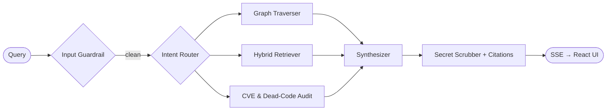

<!-- Profile README · github.com/Mayank459/Mayank459 · assets: assets/pipeline.svg + .github/workflows/snake.yml -->

<div align="center">


<a href="https://github.com/Mayank459/CodeBase">
  
</a>

<br/>


<a href="https://github.com/Mayank459?tab=followers"></a>
<a href="mailto:miyankkumar444@gmail.com"></a>

</div>

<br/>

## 👨‍💻 &nbsp;About Me

<table>
  <tr>
    <td width="55%" valign="top">

```python
class Mayank:
    education  = "B.Tech CSE @ IIIT Una"
    experience = "Full Stack Intern @ Oddiant Techlabs"
    building   = "CodeBase — repo intelligence engine"
    stack      = ["Python", "C++", "FastAPI",
                  "Node.js", "React", "Kafka"]
    creed      = "Measure it, trace it, test it."
```

</td>
    <td width="45%" valign="top">

🧠 &nbsp;**AI & dev tools** — multi-agent RAG, AST code graphs

⚡ &nbsp;**Real-time systems** — Kafka streams, WebSocket voice AI

🌾 &nbsp;**Applied ML** — AgriTech & AutoML platforms

🏆 &nbsp;**250+ DSA problems** · led **Hack the Hills** (850+ devs)

☕ &nbsp;*Chai » Code » Progress » Repeat*

</td>
  </tr>
</table>

## 💼 &nbsp;Experience

**Full Stack Developer Intern — Oddiant Techlabs** &nbsp;<sub>Oct – Dec 2025 · Remote</sub>
<br/><sub>Shipped 5+ JWT-secured Node.js/Express APIs · MongoDB indexing for **35% faster** reads · 10+ reusable React components cutting UI dev time by **30%**</sub>

**B.Tech, Computer Science — IIIT Una** &nbsp;<sub>2023 – Present</sub>
<br/><sub>PR Executive, E-Cell & Mridang cultural fest · organized E-Summit & Mridang 2025</sub>

## ⚡ &nbsp;Flagship — [CodeBase](https://github.com/Mayank459/CodeBase)

Point it at any repository and *chat with its architecture*: Tree-sitter ASTs, NetworkX call graphs, Qdrant retrieval and 6+ LangGraph agents, with guardrails, evals and Prometheus telemetry.



<div align="center">

<a href="https://code-base-tau.vercel.app"></a>
<a href="https://github.com/Mayank459/CodeBase"></a>
<a href="https://github.com/Mayank459/CodeBase/blob/main/BACKEND_ARCHITECTURE.md"></a>

| Hit Rate @ 3 | MRR | Citation Grounding | Faithfulness |
|:---:|:---:|:---:|:---:|
| **100%** | **1.00** | **100%** | **85.2%** |

</div>

<details>
<summary><b>🗺️ Agent workflow</b></summary>
<br/>


```mermaid
flowchart LR
    Q([Query]) --> IG{Input Guardrail}
    IG -->|clean| R{Intent Router}
    R --> BFS[Graph Traverser]
    R --> VEC[Hybrid Retriever]
    R --> AUD[CVE & Dead-Code Audit]
    BFS --> S[Synthesizer]
    VEC --> S
    AUD --> S
    S --> OG[Secret Scrubber + Citations] --> UI([SSE → React UI])
```

</details>

## 🚀 &nbsp;Other Projects

<table>
  <tr>
    <td width="50%" valign="top">
      <b>📡 <a href="https://github.com/Mayank459/Real-time-streaming-dashboard">Real-Time Streaming</a></b><br/>
      <sub>Kafka e-commerce event pipeline with live Grafana dashboards on AWS EC2.</sub><br/><br/>
      
    </td>
    <td width="50%" valign="top">
      <b>🎙️ <a href="https://github.com/Mayank459/ai-voice-agent">AI Voice Interviewer</a></b><br/>
      <sub>Low-latency mock interviewer over WebSockets, Faster-Whisper and Groq Llama 3.</sub><br/><br/>
      
    </td>
  </tr>
  <tr>
    <td width="50%" valign="top">
      <b>🌾 <a href="https://github.com/Mayank459/yeild_prediction_api">KhetBuddy</a></b><br/>
      <sub>Crop-yield (+18% accuracy) and irrigation (~25% less water) ML APIs for Indian farmers.</sub><br/><br/>
      
    </td>
    <td width="50%" valign="top">
      <b>📊 <a href="https://github.com/Mayank459/streamlit-automl-project">AutoML Dashboard</a></b><br/>
      <sub>No-code EDA, model search and export on 100K+ row datasets.</sub><br/><br/>
      
    </td>
  </tr>
</table>

<sub>Also: <a href="https://github.com/Mayank459/Udemy-extension">Udemy AI Summarizer</a> · <a href="https://github.com/Mayank459/DietPlanner">DietPlanner</a> · <a href="https://github.com/Mayank459/Virtual_Mouse">Virtual Mouse</a></sub>

## 🛠️ &nbsp;Tech Stack

<div align="center">


<br/>


</div>

## 📊 &nbsp;GitHub Activity

<div align="center">


<picture>
  <source media="(prefers-color-scheme: dark)"  srcset="https://raw.githubusercontent.com/Mayank459/Mayank459/output/github-snake-dark.svg" />
  <source media="(prefers-color-scheme: light)" srcset="https://raw.githubusercontent.com/Mayank459/Mayank459/output/github-snake.svg" />
  
</picture>

<br/><br/>

<sub>🔭 Currently: CodeBase 2.0 · Kafka event architectures · DSA & system design &nbsp;|&nbsp; 💼 Open to SDE / AI / Data internships</sub>


</div>
